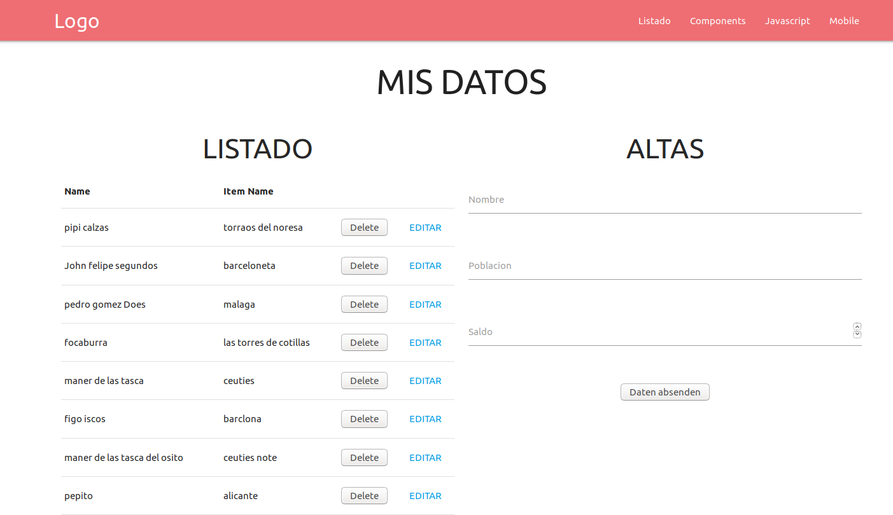

# nodejs-simple-crud-mariadb
simple crud con nodejs , mariadb-connector , materialize 1.0.0 (completo) y hbs 
Funcionamiento basico:
```ruby
mysql>CREATE DATABASE seq_db;
$ git clone https://github.com/josepereza/nodejs-simple-crud-mariadb.git
$ cd nodejs-simple-crud-mariadb
$mysql -u root -p seq_db < db.sql
//Tenemos que modificar los datos de acceso a mysql en:controllers/apicrud.js  y controllers/listado.js
$ npm install
$ npm start
```

